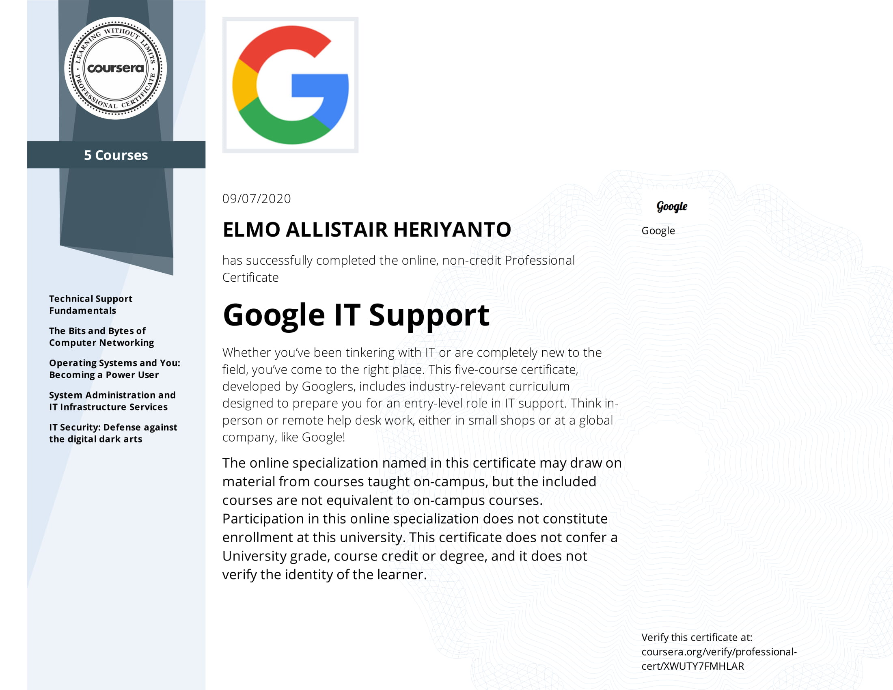

## [Google IT Support Professional Certificate](https://www.coursera.org/professional-certificates/google-it-support)

 

* This repository written for reference and self-documentation purpose
* Feel free to contribute!

 

### About this Professional Certificate

This 5-course certificate, developed by Google, includes innovative curriculum designed to prepare you for an entry-level role in IT support. A job in IT can mean in-person or remote help desk work in a small business or at a global company like Google. The program is part of Grow with Google, a Google initiative to help create economic opportunity for all. [Learn More](https://www.youtube.com/watch?v=5ZjTX0GC944&t=1s).

Upon completion of the certificate, you can share your information with top employers like Cognizant, GE Digital, Hulu, Infosys, Intel, KForce, MCPc, PNC Bank, RICOH USA, Sprint, TEKSystems, Veterans United Home Loans, Walmart and their subsidiaries, and of course, Google. You can also earn a CompTIA and Google [dual credential](https://www.blog.google/outreach-initiatives/grow-with-google/-it-support-comptia/) when you complete the Google certificate and pass the CompTIA A+ certification exams.

Through a mix of video lectures, quizzes, and hands-on labs and widgets, the program will introduce you to troubleshooting, customer service, networking, operating systems, system administration and security. You’ll hear from Googlers with unique backgrounds whose own foundation in IT support served as a jumping off point for their careers. By dedicating ~5 hours a week, you can complete in under six months.

### Applied Learning Project

Through this Professional Certificate program you'll have access to a variety of hands-on assessments which will help you to simulate many of the experiences of IT support that are critical for success in the workplace.

Examples of virtual assessments include Assembling a Computer, Networking simulation, Writing Effective Support Documentation, Routing Paths and Subnets, Wireless Networking, Device Software Management, Public Key or Asymmetric Encryption, Incident Handling, among many other hands-on learning application.

### Skills you will gain

* Binary Code
* Customer Support
* Linux
* Troubleshooting
* Domain Name System (DNS)
* Ipv4
* Network Model
* Powershell
* Linux File Systems
* Command-Line Interface
* Directory Service
* Lightweight Directory Access Protocol (LDAP)
