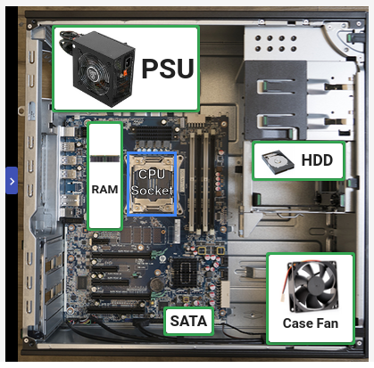

## Assemble a Computer

 

### Question 1

You will assemble a computer virtually by drag-and-dropping the components to the corresponding red sections.

In the CPU section, you will need to place the items in the correct order from bottom to top. What this means is that you will place the component on the screen in the order that you would put them into the physical computer first.

