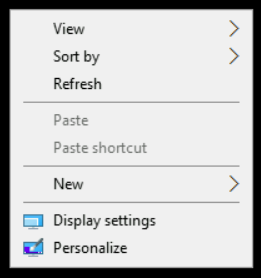
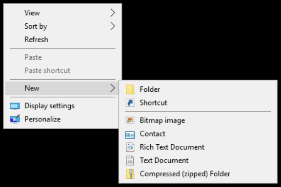

## Creating a folder

Creating a folder in Windows is super simple. Right-click anywhere on the desktop and you should see this menu appear:

Hover your cursor over "New," and another menu should appear that looks like this:

Move your cursor to the first option ("Folder"), and select it. If your cursor leaves the menus, they may disappear; if this happens, just repeat the steps again. A new folder should appear on the desktop. It'll be called "New folder" by default, and the text should already be highlighted for you to edit.

If you click anywhere before changing the name, you'll need to right-click the folder and select the "Rename" option to be able to edit it. Change the name to "My Super Cool Folder".

Your folder has been created and named! To verify, double-click on the folder and a Windows Explorer window should pop up, showing you the contents of your currently empty folder.

