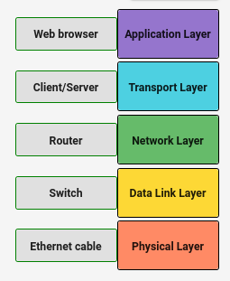

## Layers in Networking Models

 

### Question 1

Let's test your knowledge of the five-layer networking model presented in this course!

**Step 1**: Drag-and-drop a networking layer into the correct order on the right-hand side of the screen. Do this for all five layers represented. If you make a mistake, click the 'Reset' button to try again.

**Step 2**: After you’ve identified the five networking layers, you will be presented with a networking hardware component. This component represents a different item in the networking model. Like you did in Step 1, drag-and-drop these into the correct order. If you make a mistake, click the 'Reset' button to try again.

**Step 3**: When you’re done, close the quiz (if in fullscreen) and click the “Submit Quiz” button to earn a grade.

