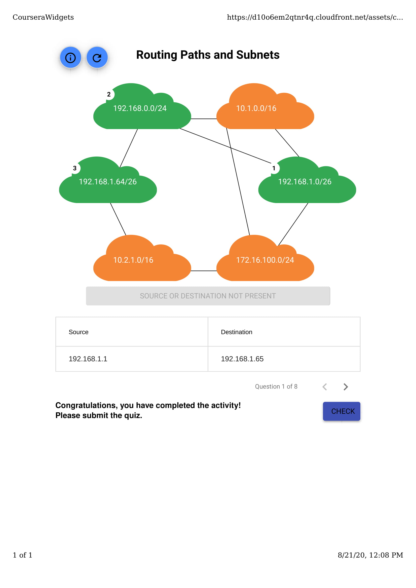
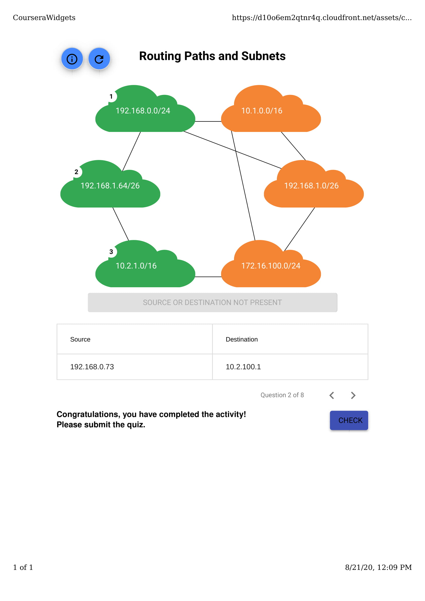
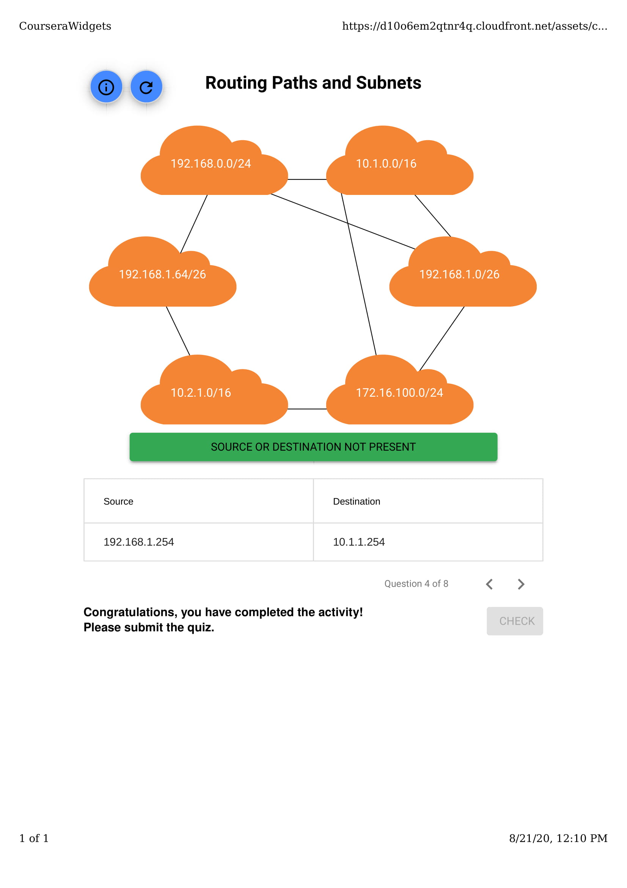
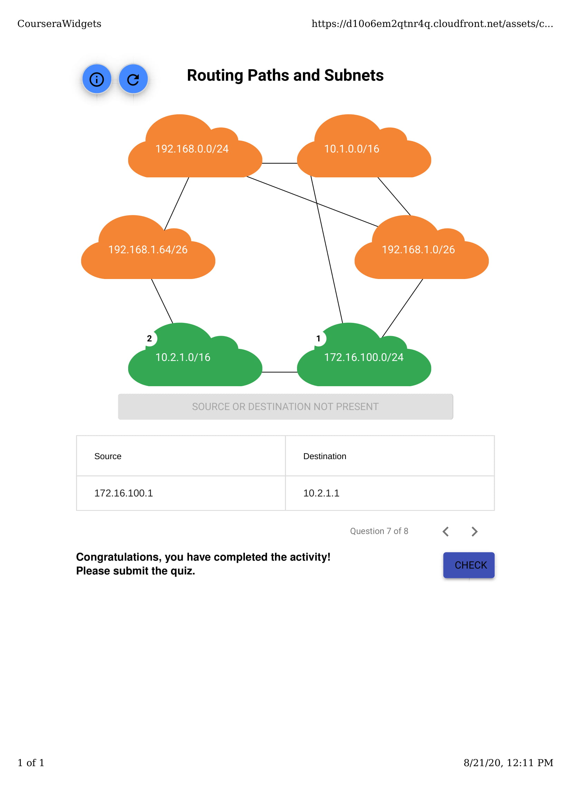
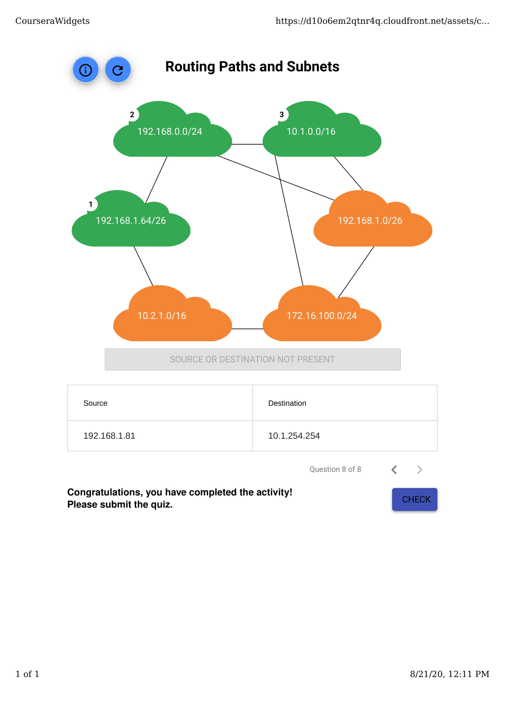

## Routing Paths and Subnets

 

### Question 1

Let’s see how much you’ve learned about routing paths and subnetting! In this activity, you are given a bunch of source and destination IP address pairs. Your task is to route each of these packets from the correct source network to the correct destination network.

**Step 1**: You will be presented 8 source and destination IP address pairs in the table below.

**Step 2**: You will mimic how the packets travel from the source IP address to the destination IP address within the network. Click the network source (the corresponding orange bubble) and click all the networks it needs to use in order to reach the destination network. You will need to click each network in the right order.

**Step 3**: After you’ve selected the source and destination networks, click the “Check” button. Some of these address pairs may not be represented by the networks available. If that’s the case, click the “Source or destination not present” button. If you make a mistake, click the “Reset” button to try again.

**Step 4**: Once you have correctly answered a question, move on to the next question by clicking on the next question arrow. There are 8 different questions.

**Step 5**: After you’ve completed all routing paths listed in the table, close the quiz and click the “Submit Quiz” button for a grade.

 
 

