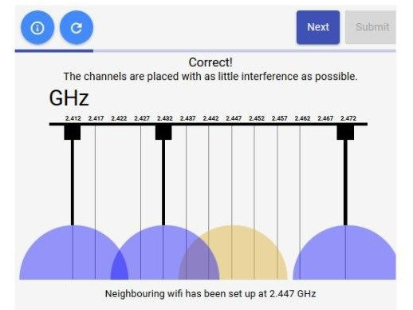
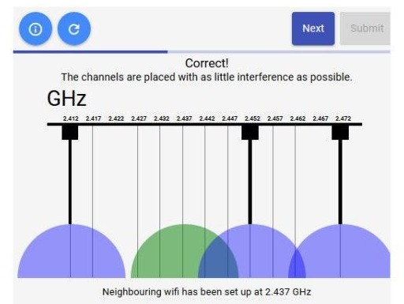
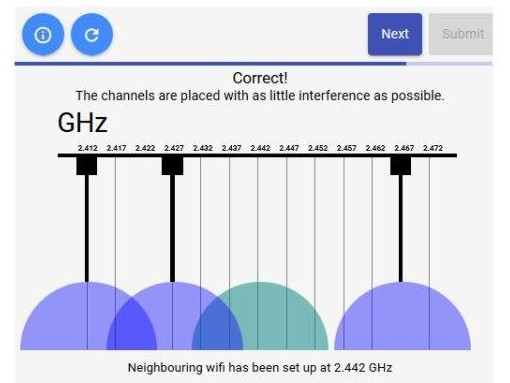
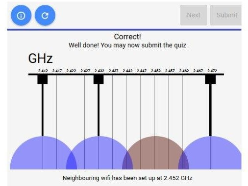

## Wireless Channels

**Latest Submission Grade: 100%**

### Question 1

Let’s see how much you learned about wireless channels and how to select the optimal setup!

Here’s the scenario: You’re an IT Support Specialist that has setup three wireless channels for a company. As time goes on, neighboring companies have their own wireless networks coming into operation. This causes network interference between your networks and their network.

**Step 1**: You’ll see three wireless channels with access points that you control. These are represented by the orange bubbles on the screen. You can drag these around on the screen using the grey rectangle at the top of the bubble.

**Step 2**: After a few seconds, a new wireless network will appear, which is represented by a different colored bubble. This represents the competing wireless networks.

**Step 3**: Minimize network interference by moving your wireless channels so there’s as little overlap as possible for all wireless channels.

**Step 4**: Once you’ve best positioned the wireless channels, click “Submit.”

**Step 5**: If you successfully minimized network interference, click the “Next” button and you’ll respond to a new scenario based on your previous answer. You have 5 scenarios to complete for this activity. If your answer is wrong, click “Reset” and try again.

 
 

