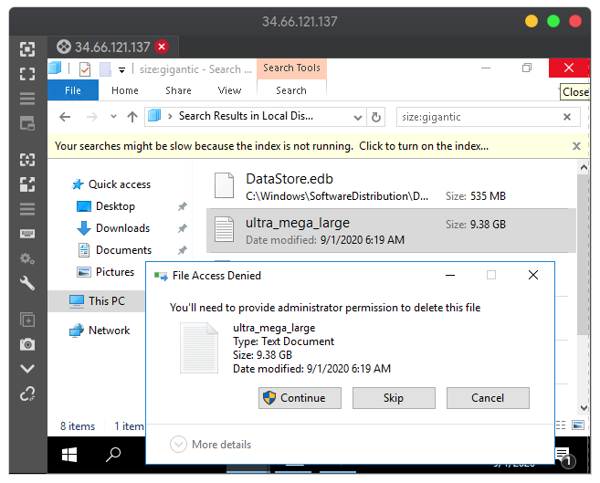
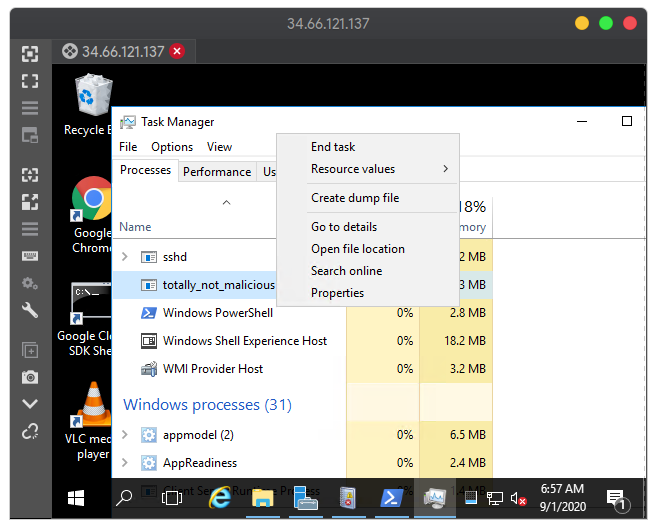
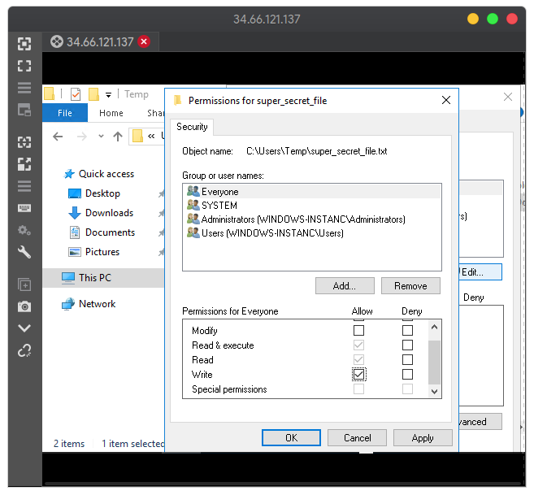

# Qwiklabs Windows

## Steps

Complete the following steps:

1. Delete ultra_mega_large (9.38 GB) file, use search feature
2. Delete corrupted file in `C:\Users\Documents`
3. Update VLC, download installer: <https://www.videolan.org/vlc/download-windows.html>, install and choose update
4. End malicious processes, go to task manager, search for `"totaly_not_malicious"`, end task
5. Fix Permissions , go to `C:\Users\Temp`, open super_secret_file's properties, check write's box permission

## Screenshots

### Step 1 - Delete Large File

### Step 3 - Update VLC

### Step 4 - End Malicious Process

### Step 5 - Fix Permissions

